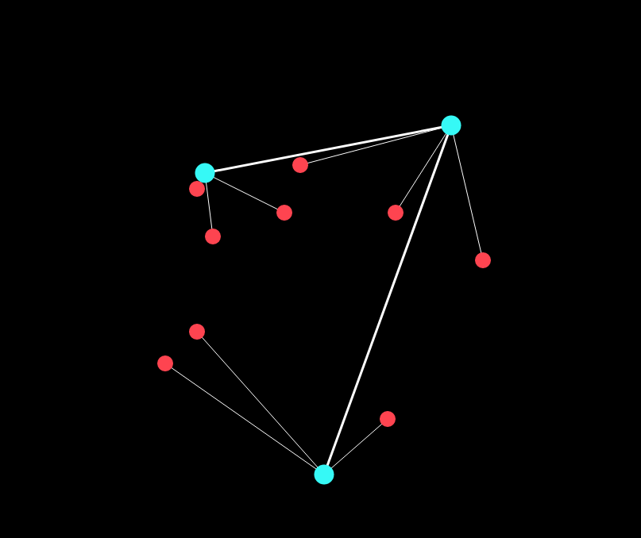

# Network Nodes

Randomly generates a network of nodes using the given configuration.

## Example



## Usage

If you are using typescript, copy the `app.ts` into your project.
If you are using javascript, copy the `app.js` into your project.

### 1. Create an array of nodes:

``` javascript
const nodes = [{
  id: 'R1',
  connections: ['R3'],
  children: [{
    id: 'R1C1'
  }, {
    id: 'R1C2'
  }, {
    id: 'R1C3'
  }]
}, {
  id: 'R2',
  connections: ['R1'],
  children: [{
    id: 'R2C1'
  }, {
    id: 'R2C2'
  }, {
    id: 'R2C3'
  }]
}, {
  id: 'R3',
  connections: [],
  children: [{
    id: 'R3C1'
  }, {
    id: 'R3C2'
  }, {
    id: 'R3C3'
  }]
}];
```

This will create a network containing 3 Root nodes.
Each root node has 3 children.

### 2. Call `generate(nodes)`

This will generate the svg and return it.
You can now add the svg to your view.

For more examples see `example_1.html` and `example_2.html`.
